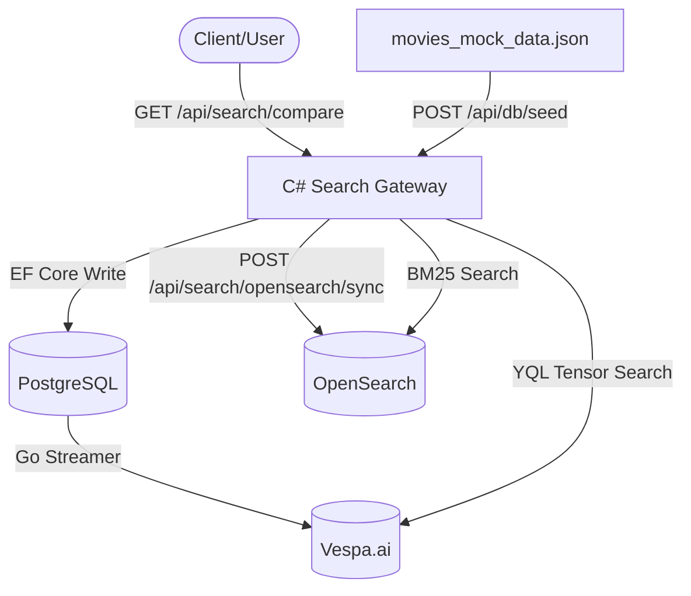

# Dual-Search Evaluation Architecture (POC)

This POC project builds a **Dual-Search Evaluation Architecture** to compare **OpenSearch** and **Vespa.ai** side by side. PostgreSQL acts as the primary database (transactional "Source of Truth"), broadcasting data to both read-only search engines. A unified comparison gateway built in C# (.NET 10.0) queries both search engines concurrently, timing their performance and returning side-by-side results.

## Architecture Diagram



---

## Workspace Layout
- `docker-compose.yml`: Local Docker environment containing Postgres, OpenSearch, and OpenSearch Dashboards (Vespa to be added in Phase 3).
- `src/SearchGateway/Data/movies_mock_data.json`: Pre-constructed mock database containing 1,000 movies with rich metadata.
- `src/SearchGateway/`: C# .NET 10.0 Web API gateway.
- `docs/concepts_and_mappings.md`: Conceptual explanation of SQL vs Search and detailed index structures.
- `.agents/`: Project-scoped coding guidelines and customized search engine skill helpers.

---

## Getting Started

### 1. Prerequisites
- Docker & Docker Compose
- .NET 10.0 SDK

### 2. Start Infrastructure
Run the following command in the project root to spin up PostgreSQL, OpenSearch, and OpenSearch Dashboards:
```bash
docker compose up -d
```

### 3. Run C# Web API Gateway
From the workspace root, run:
```bash
dotnet run --project src/SearchGateway/SearchGateway.csproj --launch-profile http
```
The application will listen on `http://localhost:5042`. On startup, it automatically ensures the PostgreSQL database and tables are created.

---

## Verifying Phase by Phase

### Phase 1: Relational Foundation (Postgres)
1. **Seed Postgres**: Trigger data load from `src/SearchGateway/Data/movies_mock_data.json` to Postgres:
   ```bash
   curl -i -X POST http://localhost:5042/api/db/seed
   ```
2. **Verify Database Content**: Check that movies are successfully retrieved:
   ```bash
   curl -i http://localhost:5042/api/movies
   ```

### Phase 2: OpenSearch Integration
1. **Sync to OpenSearch**: Bulk index the database contents into OpenSearch:
   ```bash
   curl -i -X POST http://localhost:5042/api/search/opensearch/sync
   ```
2. **Verify Index Search**: Run a keyword search on OpenSearch (e.g. searching for "cyberpunk"):
   ```bash
   curl -i "http://localhost:5042/api/search/opensearch?q=cyberpunk"
   ```
3. **OpenSearch Dashboards**: Open `http://localhost:5601` in your browser to run Dev Tools console queries on the `movies` index.

### Phase 3: Vespa Integration
1. **Start Vespa**: Run the Vespa container (already defined in `docker-compose.yml`):
   ```bash
   docker compose up -d vespa
   ```
2. **Deploy Configuration**: Run the packaging and deployment script:
   ```bash
   bash .agents/skills/vespa-integration/scripts/deploy.sh
   ```
3. **Verify Search API**: Query Vespa to make sure the schema is active (returns 0 results because it is not seeded yet):
   ```bash
   curl -s "http://localhost:8080/search/?yql=select+*+from+movie+where+true"
   ```
4. **Sync Postgres to Vespa**: Seed the Vespa content index from the C# gateway:
   ```bash
   curl -i -X POST http://localhost:5042/api/search/vespa/sync
   ```
5. **Search Vespa via Gateway**: Execute a query against the C# Vespa endpoint:
   ```bash
   curl -i "http://localhost:5042/api/search/vespa?q=cyberpunk"
   ```
6. **Compare Search Engines**: Benchmark OpenSearch and Vespa side-by-side:
   ```bash
   curl -i "http://localhost:5042/api/search/compare?q=cyberpunk"
   ```

### Vespa CLI & YQL Examples
You can execute YQL queries directly inside the running Docker container using the pre-installed Vespa CLI:

* **Filter by rating** (Numeric filter):
  ```bash
  docker exec movies-vespa vespa query 'select * from movie where rating > 9.0'
  ```
* **Filter by genre** (Array check):
  ```bash
  docker exec movies-vespa vespa query 'select * from movie where genres contains "Sci-Fi"'
  ```
* **Logical AND (90s Sci-Fi)**:
  ```bash
  docker exec movies-vespa vespa query 'select * from movie where genres contains "Sci-Fi" and release_year >= 1990 and release_year <= 1999'
  ```
* **Sort and limit**:
  ```bash
  docker exec movies-vespa vespa query 'select * from movie where true order by rating desc limit 3'
  ```
* **Multi-Match Search** (Combine text search with structured filters):
  ```bash
  docker exec movies-vespa vespa query "yql=select * from movie where userQuery() and genres contains 'Sci-Fi'" "query=hacker"
  ```


